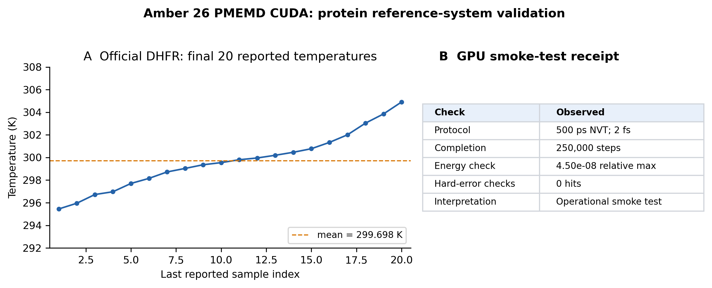
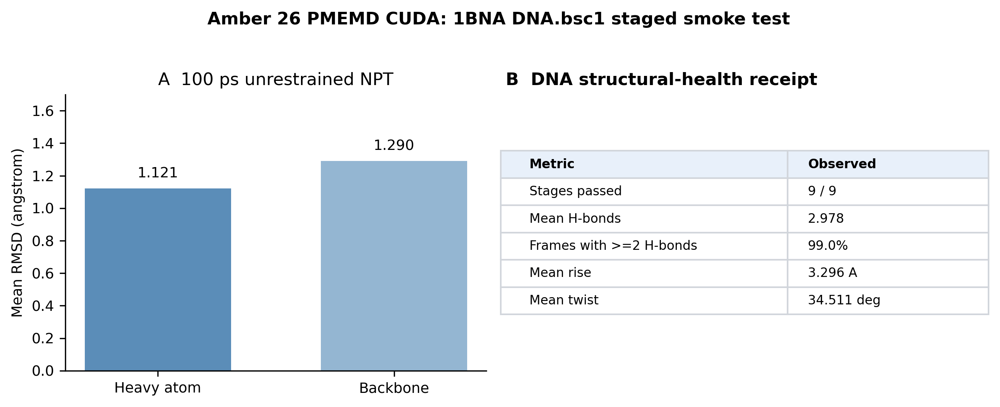

# Amber 26 PMEMD CUDA on Blackwell (CUDA 12.9)

**A practical, evidence-gated build and validation kit for running Amber 26 PMEMD CUDA on NVIDIA Blackwell GPUs (`sm_120`).**



> Compilation is not acceptance. This guide requires a real GPU canary, hard-failure scanning, non-empty output artifacts, and both protein and DNA smoke tests before calling an installation operational.

## What is included—and deliberately excluded

This repository contains original documentation, portable shell/Python scripts, small derived metric tables, and regenerated figures. It does **not** contain Amber source or binaries, licensed Amber test inputs, topology/restart files, trajectories, job logs, addresses, hostnames, accounts, mounts, access settings, or credentials.

Amber remains separately licensed by the Amber project. Obtain your Amber 26 source distribution and any official test cases through the appropriate channel.

## Tested build record

| Component | Tested value |
|---|---|
| Amber engine | Amber 26 PMEMD CUDA |
| GPU family / tested device | NVIDIA Blackwell / GeForce RTX 5090 |
| CUDA toolkit | 12.9 |
| CUDA architecture target | `sm_120` (compute capability 12.0) |
| GPU driver | 580.95.05 |
| Build generator | Ninja |
| Accepted only after | dynamic-library check, architecture inspection where available, and real GPU MD execution |

The record above documents one working build-and-test environment. It is not a blanket compatibility guarantee for every driver, compiler, scheduler, or Amber patch level.

## Evidence, with scope stated plainly

| Case | Protocol | Observed result | What this supports |
|---|---|---|---|
| Official Amber DHFR input | 500 ps NVT, 2 fs timestep | 250,000 steps completed; final 20-sample temperature mean 299.698 K; 20-step energy comparison max relative difference `4.502018e-08`; no configured hard-error hits | sustained PMEMD CUDA operation on a protein reference system |
| 1BNA DNA, DNA.bsc1/TIP3P | 6 staged minimizations, 50 ps NVT, 100 ps restrained NPT, 100 ps NPT; 2 fs timestep | 9/9 stages completed; no configured hard-error hits; short-window structural metrics produced | DNA workflow, trajectory writing, and analysis-chain health |

The protein input was an official **pre-parameterized** Amber reference case, not a new protein parameterization. The DNA result is a short structural-health smoke test, not an equilibration or force-field-accuracy claim.



The underlying, compact numbers and their caveats are in [results/README.md](results/README.md). Both figures can be regenerated from tracked TSV data with:

```bash
python scripts/render_result_figures.py
```

## Fast path

```bash
git clone https://github.com/YOUR_ACCOUNT/amber26-blackwell-cuda129-guide.git
cd amber26-blackwell-cuda129-guide

# Use only your licensed source tree and writable, non-transient storage.
export AMBER_SRC=/absolute/path/to/amber26-src
export BUILD_DIR=/absolute/path/to/amber26-cuda129-build
export PREFIX=/absolute/path/to/amber26-cuda129-install
export CUDA_HOME=/usr/local/cuda-12.9

bash scripts/configure_cuda129_sm120.sh
bash scripts/build_install_pmemd_cuda.sh

# Select the PMEMD CUDA executable installed by your Amber build.
export ENGINE="$PREFIX/bin/pmemd.cuda_SPFP"
bash scripts/preflight_blackwell_pmemd.sh
```

The CMake flags are a transparent starting point for the documented Amber 26/CUDA 12.9 configuration. Always check them against the official installation guide shipped with your exact Amber release and patch level.

## The acceptance ladder

```text
GPU/driver/toolkit identity
        ↓
binary architecture and dynamic-library inspection
        ↓
short real-GPU PMEMD CUDA canary
        ↓
official pre-parameterized protein smoke test
        ↓
independently parameterized DNA staged smoke test
        ↓
trajectory/structure metrics and cautious interpretation
```

Detailed pass/fail rules: [docs/validation-gates.md](docs/validation-gates.md).

An executable, a non-empty restart, or exit code zero alone does **not** pass the ladder. Treat `CUDA_ERROR`, `FATAL`, NaN/Inf, SHAKE errors, `REPEATED LINMIN FAILURE`, VDW overflow, and extreme gradients as hard failures even when a launcher claims success.

## Scripts

| Script | Purpose |
|---|---|
| `configure_cuda129_sm120.sh` | isolated CMake/Ninja configuration requesting `CMAKE_CUDA_ARCHITECTURES=120` |
| `build_install_pmemd_cuda.sh` | build and install, then locate the PMEMD CUDA executable |
| `preflight_blackwell_pmemd.sh` | inspect GPU, compiler, linked CUDA libraries, and `sm_120` when `cuobjdump` is available |
| `run_official_dhfr_500ps_smoke.sh` | generic 500 ps NVT driver for legally obtained official DHFR input |
| `run_1bna_dna_bsc1_staged_smoke.sh` | conservative, editable nine-stage DNA template |
| `check_md_log.sh` | fail-closed scan for known CUDA/numerical signatures |
| `render_result_figures.py` | regenerate public figures only from compact TSV metrics |
| `scan_sensitive_content.py` | release gate for common infrastructure/credential leaks |

Every shell script requires explicit environment variables. It never supplies a host, account, mount, or private source location.

## Protein and DNA smoke-test recipes

### Protein: official DHFR

After obtaining the official input through your Amber distribution:

```bash
export ENGINE=/absolute/path/to/pmemd.cuda_SPFP
export TOP=/absolute/path/to/dhfr.prmtop
export RST=/absolute/path/to/dhfr.rst7
export OUT_DIR=/absolute/path/to/new-dhfr-smoke-result
bash scripts/run_official_dhfr_500ps_smoke.sh
```

### DNA: staged 1BNA template

Prepare a solvated, neutralized DNA.bsc1/TIP3P `prmtop/rst7` pair separately; check residue indices and change the example restraint mask for your system.

```bash
export ENGINE=/absolute/path/to/pmemd.cuda_SPFP
export TOP=/absolute/path/to/dna_bsc1_solvated.prmtop
export RST=/absolute/path/to/dna_bsc1_solvated.rst7
export OUT_DIR=/absolute/path/to/new-dna-smoke-result
bash scripts/run_1bna_dna_bsc1_staged_smoke.sh
```

The template intentionally stops at a small smoke test. Extend duration only after inspecting density, temperature, energy, RMSD/RMSF, base-pair hydrogen bonds, and helical descriptors with cpptraj plus a DNA-appropriate analysis tool.

## Installable Codex skill

[`skills/amber26-blackwell-cuda129/SKILL.md`](skills/amber26-blackwell-cuda129/SKILL.md) is a sanitized, reusable procedure for probing a worker, compiling, validating, and triaging PMEMD CUDA. It keeps infrastructure values as runtime variables and uses the same hard-failure policy as the scripts.

## Release hygiene

Before committing or publishing:

```bash
python scripts/scan_sensitive_content.py .
git status --ignored
git diff --cached --check
```

Read [docs/sanitization.md](docs/sanitization.md) and manually inspect diffs. The scanner is a guardrail; it cannot prove a repository is safe to publish.

## Citation and license

Please cite Amber and cpptraj according to the documentation for the version you use. The original scripts and documentation here are [MIT licensed](LICENSE); Amber is not bundled and remains subject to its own license.
